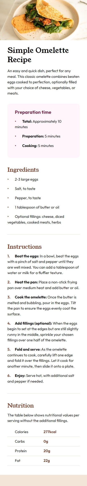

# Frontend Mentor - Recipe page solution

This is a solution to the [Recipe page challenge on Frontend Mentor](https://www.frontendmentor.io/challenges/recipe-page-KiTsR8QQKm). Frontend Mentor challenges help you improve your coding skills by building realistic projects. 

## Table of contents

- [Overview](#overview)
  - [The challenge](#the-challenge)
  - [Screenshot](#screenshot)
  - [Links](#links)
- [My process](#my-process)
  - [Built with](#built-with)
  - [What I learned](#what-i-learned)
  - [Continued development](#continued-development)
  - [Useful resources](#useful-resources)
- [Author](#author)

## Overview

### Screenshot

### Links

- Solution URL: [GitHub Repository](https://github.com/rodolfohgc/recipe-page)
- Live Site URL: [GitHub Pages ](https://rodolfohgc.github.io/recipe-page/)

## My process

### Built with

- Semantic HTML5 markup
- CSS custom properties
- Mobile-first workflow

### What I learned

It took more time than I imagined to complete this challenge, as I’m not really used to working with lists and tables. Customizing the bullet points and list counters is not so intuitive, so I had to do some research.

### Continued development

I approached this challenge with a mobile-first vision. Working on a desktop PC makes us forget that nowadays the majority of web users browse with a smartphone, so this should be the standard paradigm of web development.

### Useful resources

- [CSS: colored bullets and list numbers (W3)](https://www.w3.org/Style/Examples/007/color-bullets.en.html) - This helped me to customize the bullet points and list numbers.

## Author

- Frontend Mentor - [@rodolfohgc](https://www.frontendmentor.io/profile/rodolfohgc)
- Twitter - [@rodolfohgc](https://www.x.com/rodolfohgc)
- GitHub - [@rodolfohgc](https://github.com/rodolfohgc)
- Instagram - [@rodolfohgc](https://www.instagram.com/rodolfohgc/)